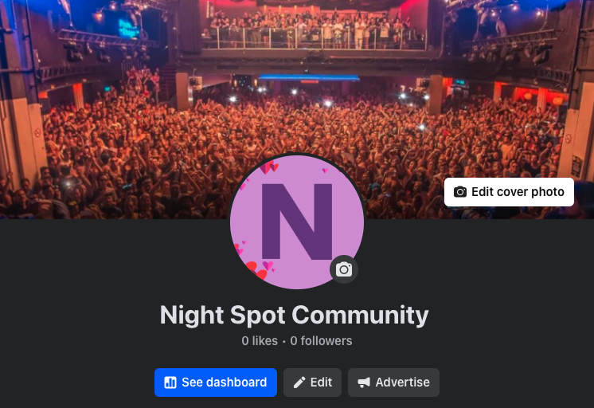

# Project5 - Night Spot 

## Project Rationale and Purpose

### Rationale: 
 
 Night Spot is a web application aimed at individuals looking to buy, sell, or trade secondhand tickets for nightlife events and club guest lists. This platform offers a secure marketplace, integrating an e-commerce payment solution to ensure safe transactions. 

### Purpose: 
 The project is designed to solve the issue of eventgoers struggling to resell or find last-minute tickets. Night Spot connects buyers and sellers in a secure environment while offering features like FAQs, contact forms reviews, and ratings.

## Deployment & Testing Procedures
 
 ### Deployment: 
 The project is deployed on Heroku. To deploy:
  1. Push code to GitHub. (Ensure the latest version of your code is pushed to the GitHub repository for easy integration with Heroku)
  2. Connect the Heroku app to GitHub repository. (Log in to Heroku, create a new app, and link it to your GitHub repository under the "Deploy" tab)
  3. Set config vars (e.g. Stripe, Brevo) in Heroku. (Set necessary configuration variables)
  4. Ensure DEBUG=False is are set. (Update DEBUG=False in settings.py to disable development mode)
  5. Ensure all required environment variables. (Ensure all are correctly configured to avoid deployment errors)
  6. Deploy branch and open via Heroku. (Choose the branch to deploy and click "Deploy Branch" in Heroku) 
  7. Test the live app at the Heroku URL. (Open the deployed app via the Heroku URL and thoroughly test its functionality)

  ### Manual Testing:

   The application underwent extensive manual testing to ensure all functionalities work as intended:

  1. Form Validation: Verified that forms such as ticket creation, newsletter signup, and user registration work correctly, displaying errors for invalid inputs and processing valid submissions smoothly.
  2. Payment Security: Tested Stripe payment integration to confirm secure and accurate transactions, ensuring tickets are correctly marked as sold post-purchase.
  3. Authentication and Authorization: Checked user authentication flows, including login, signup, and role-based access restrictions, ensuring non-authenticated users cannot access restricted areas.
  4. SEO Features: Reviewed sitemap generation, robots.txt, and meta tags to ensure the app complies with SEO best practices and is discoverable by search engines.
 
 ### Automated Testing: 

   Automated testing was conducted using Django's TestCase framework to validate core application functionality.
   
   1. A basic test was implemented to verify that critical operations like creating tickets and processing user inputs function without errors.
  

##  E-commerce Business Model

  Night Spot functions as a peer-to-peer ticket marketplace specializing in nightlife events. The platform connects buyers and sellers of event tickets and guest list spots while charging a service fee per transaction to generate revenue.

1. For Buyers: Users can find tickets for sold-out events or secure guest list spots for exclusive venues. The platform offers a secure checkout process through Stripe.
3. For Sellers: Users can resell tickets they no longer need or list guest list spots for events. Sellers benefit from a user-friendly interface to manage listings.

  The service aims to provide value to both buyers and sellers by creating a secure, reliable, and user-centric platform for nightlife ticket transactions.

## How to Use

Night Spot provides a straightforward process for buying and selling tickets for nightlife events and guest list spots:

1. Browsing Tickets:
Upon visiting the website, users can view available tickets for upcoming events directly from the homepage.

2. Account Creation:
To purchase or list tickets, users must sign up and log in. Registration is simple and ensures secure transactions.

3. Ticket Purchase:
Logged-in users can select tickets, view detailed information, and proceed to checkout using Stripe's secure payment system. Upon successful payment, tickets are moved to the user's "Bought Tickets" section.

4. Listing Tickets for Sale:
Users can create their own ticket listings through the dashboard. They can provide event details, pricing, and availability. Listings can be managed directly from the user dashboard, with options to edit or delete.

5. Post-Purchase Features:
After a successful transaction, users can leave reviews and ratings for their experience, fostering trust and transparency within the community.

The platform ensures a smooth experience for buyers and sellers by integrating features such as real-time updates, secure payments, and user-friendly navigation.

## My Goal

 The main goal of Night Spot is to create a safe, user-friendly marketplace where people can resell tickets for nightlife events or offer guest list spots for nightclubs. It bridges the gap between people who have spare tickets and those who are seeking access to sold-out or exclusive events. By providing an easy-to-use interface, Night Spot aims to streamline the process of ticket reselling, reducing the reliance on less secure methods of ticket trading.

 Another key objective is to foster a community-driven platform where buyers and sellers can trust one another through verified profiles, reviews, and seamless payment integrations. Through this, Night Spot ensures a better experience for users, enabling them to focus on the enjoyment of nightlife rather than ticket logistics.

## User Stories 

 I used the agile tools on Git Hub to track my progress and post user stories. They changed voer time as I had to re work and re deploy. 

### Event Newsletter Emails
 I implemented an event newsletter feature using the Brevo via an API. I created a form that allows users to submit their email and depending on the API response, success or error messages are displayed.

### Site Admin Overview
 I provided admin functionality that allows site administrators to manage ticket listings and users. Admins can review and remove ticket listings, manage user accounts, and oversee transactions through the Django admin interface.

### Customer Confidence
 I implemented Stipe via an API webhook for secure payment processing, so a user can pay for it securely and with confidence. 

### Sell or Donate Spare Tickets or G List Spots
 I implemented a feature where users can list tickets for sale or donate them for 1 EUR (a minimal amount is required as the site would ideally need to take a processing fee at some point in the future). The process involves filling out a form regarding event details and setting the desired price or minimum price option. Users can manage their listings after their log in.

### Browse Potential Events
 I created a browsing feature where users can view all available tickets. Events are listed with key details such as event name, date, and ticket price. 

### Social Media 

 I now have a functioning FaceBook page for the project. 

## Operational Tracking 

 I utelized the operational tracking tool in GitHub to keep track of To-Do's and Tasks as they went. These can be seen here: 
 
 

 

## Data Models 

The data models in Night Spot are carefully designed to capture the core elements of ticket trading, user interaction, and administrative functionalities. These models form the backbone of the platform, enabling seamless user experiences and efficient data management. Below is a detailed breakdown of the key data models:

### Ticket Model

The Ticket model is the cornerstone of the platform, encapsulating all the essential details about tickets listed for sale or purchase. Key attributes include:

1. Event Details: Stores information such as event name, date, and ticket type (e.g., guest list, skip list, or standard).
2. Pricing: Tracks ticket price as a decimal field for precision.
3. Availability: Includes is_available and is_sold boolean fields to manage ticket status dynamically based on user actions (e.g., purchase).
4. Ownership and Transactions:
   seller: A foreign key linking the ticket to the user who listed it.
   buyer: A nullable foreign key for the user who purchases the ticket.
   unique_code: A unique identifier for each ticket, useful for verification or QR code generation.

5. Audit Fields: Includes fields like modified_at to log updates and ensure traceability.

### User Model

The platform leverages Django's built-in User model for managing user data, extended with custom attributes and relationships to accommodate the unique roles of buyers and sellers:

1. Authentication and Profile Management: Handles user signup, login, and profile updates.
2. Role Differentiation: Supports role-specific functionalities, enabling buyers to purchase tickets and sellers to list and manage their tickets.
3. Relationships: Links to other models (e.g., Ticket and Testimonial) to reflect user actions and contributions to the platform.

### FAQ Model
The FAQ model provides a centralized repository for frequently asked questions and their answers, enhancing user accessibility and reducing support inquiries:

1. Question and Answer Fields: Stores common queries and their corresponding solutions in text fields.
2. Audit Fields: Tracks creation and update timestamps to ensure the FAQ section remains current and accurate.

This model is vital for maintaining an up-to-date knowledge base and improving overall user satisfaction.

### ContactForm Model

The ContactForm model allows users to reach out to the platform administrators with queries, feedback, or issues:

1. User Input Fields: Includes fields for the user's name, email address, and message content.
2. Backend Processing: Integrates with email functionality to forward submissions to the admin team.
3. Validation: Ensures that all required fields are completed correctly before submission.

This model supports direct user communication, fostering trust and responsiveness.

### Testimonial Model

The Testimonial model provides a way for users to share feedback about their experiences with the platform:

1. User Relationship: Links testimonials to their authors via a foreign key.
2. Content Fields: Includes fields for a title and detailed feedback.
3. Approval System: Features an admin-controlled approved field, ensuring only appropriate content is displayed publicly.

### Scalability and CRUD Functionality

All models are designed with flexibility in mind, enabling full CRUD (Create, Read, Update, Delete) operations. This architecture ensures that:

1. Users: Can manage tickets and profiles easily.
2. Admins: Have full control over content like FAQs and testimonials.
3. Platform Growth: The structure accommodates new features and data relationships as the platform evolves.

By building a robust and interconnected data model framework, Night Spot effectively supports its mission of providing a secure, user-friendly, and scalable ticket marketplace for nightlife events.

## Credits of Resources 

### Night Spot's development is built on several inspirations and open-source resources. 

### Documentation and Guides  

The below official documentation provided detailed guidance, enabling the integration of essential technologies and frameworks into the project:

  1. Stripe Documentation - Helped with setting up and managing secure payment processing, webhooks, and Stripe Checkout sessions.
  2. Django Documentation - Served as a comprehensive guide for implementing the backend framework, user authentication, and data modeling.
  3. Brevo (Sendinblue) API Documentation - Assisted in integrating the newsletter signup functionality for user engagement.

### Troubleshooting and Enhancement Resources

The below resources were instrumental in troubleshooting code issues, learning best practices, and enhancing functionality:

 1. Stack Overflow - Helped resolve specific coding challenges and provided community-driven insights into best practices.
 2. Real Python - Offered in-depth tutorials and examples for Django development and advanced Python techniques.
 3. W3Schools - Provided a reference for front-end technologies, including HTML, CSS, and JavaScript.
 

### Libraries Utilized

 Night Spot leverages several libraries and tools to provide its functionality. Django serves as the core backend framework, providing robust tools for handling user authentication, data models, and routing. For payments, the Stripe Python SDK is used to manage secure payment processing, while the Brevo (formerly Sendinblue) API handles the newsletter subscription feature.

 On the front-end, Bootstrap ensures that the UI is responsive and user-friendly across devices. Other libraries include Django’s message framework for user notifications, as well as the requests library for making API calls to external services. These libraries help Night Spot function smoothly, offering a secure and pleasant user experience. 

## E-commerce Business Model

### Revenue Model: 
 Night Spot operates on a peer-to-peer transaction basis, in the future real world I would implement charging a service fee on each successful ticket sale through Stripe. This fee ensures the platform remains sustainable and supports future development.

### Target Audience: 
 Night Spot caters to individuals looking to buy or sell secondhand tickets for nightlife events or offer guest list spots to clubs. The platform is built for both casual event-goers and sellers with spare tickets.

### Transaction Model: 
 Users can list tickets for sale, with buyers purchasing directly through a secure checkout system integrated with Stripe. Ticket listings are managed by the seller, and the transaction is completed directly on the platform. The donation option also allows sellers to offer tickets for 1 EUR as a minimal charge.
