# Project5 - Night Spot 

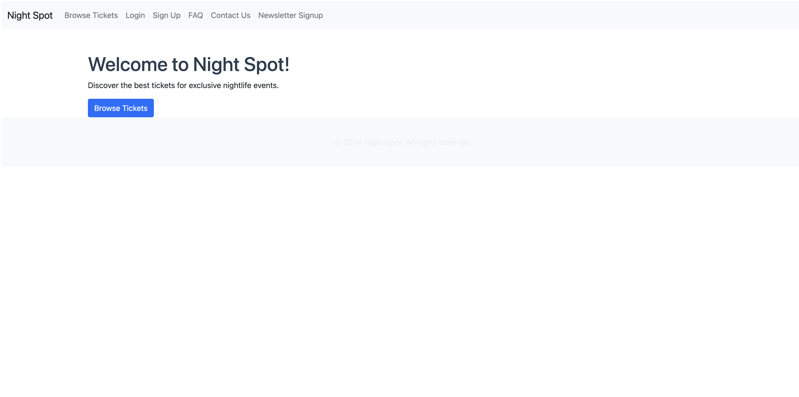

## Project Rationale and Purpose

### Rationale: 
 
 Night Spot is a web application aimed at individuals looking to buy, sell, or trade secondhand tickets for nightlife events and club guest lists. This platform offers a secure marketplace, integrating an e-commerce payment solution to ensure safe transactions. 

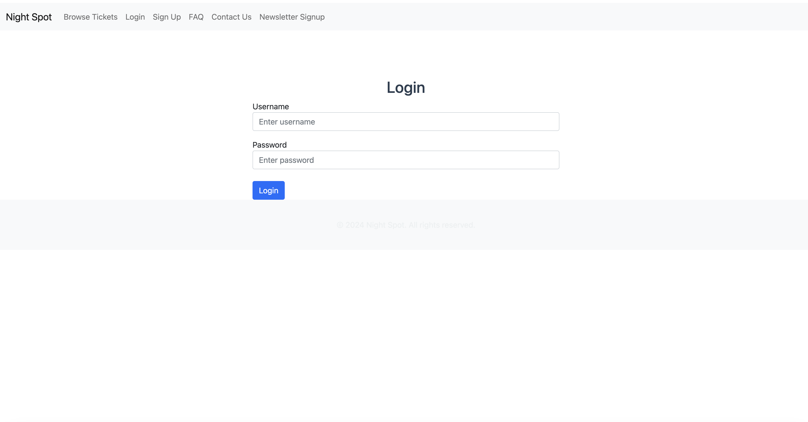

### Purpose: 
 The project is designed to solve the issue of eventgoers struggling to resell or find last-minute tickets. Night Spot connects buyers and sellers in a secure environment while offering features like FAQs, contact forms reviews, and ratings.

## Deployment & Testing Procedures
 
 ### Deployment: 
 The project is deployed on Heroku. To deploy:
  1. Push code to GitHub.
  2. Connect the Heroku app to GitHub repository.
  3. Set config vars (e.g. Stripe, Brevo) in Heroku.
  4. Ensure DEBUG=False and required environment variables are set in settings.py.
  5. Deploy branch and open via Heroku . 
  6. Test the live app at the Heroku URL.

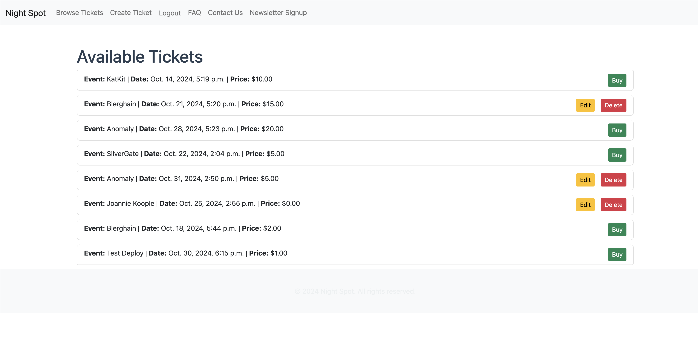

  ### Manual Testing:
  1. Verify all forms (ticket creation, newsletter signup, etc.) work correctly.
  2. Ensure secure payments using Stripe.
  3. Check user authentication and role-based access.
  4. Test SEO features like sitemap, robots.txt, and meta tags.

 ### Automated Testing: 
  1. I ran a simple automated test using 'Django’s TestCase' framework to make sure that my project’s core functionality worked. The test checked that the system could make basic operations, so it passed without any issues. I used the command 'python manage.py' test, and it was "OK".

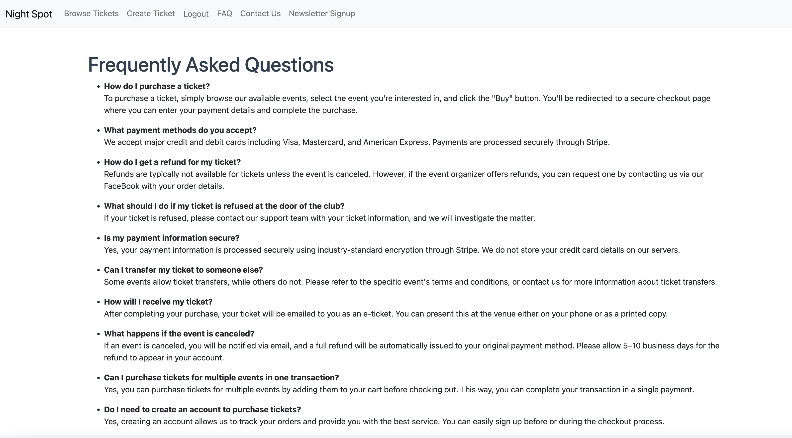

##  E-commerce Business Model

  Night Spot operates as a peer-to-peer ticket marketplace. Users can list tickets for sale or purchase, while others can purchase or inquire about guest list spots. The platform charges a service fee per transaction (using Stripe) to generate revenue. The platform provides value for both buyers, who find tickets for sold-out events, and sellers, who resell tickets they no longer need.

## How to Use

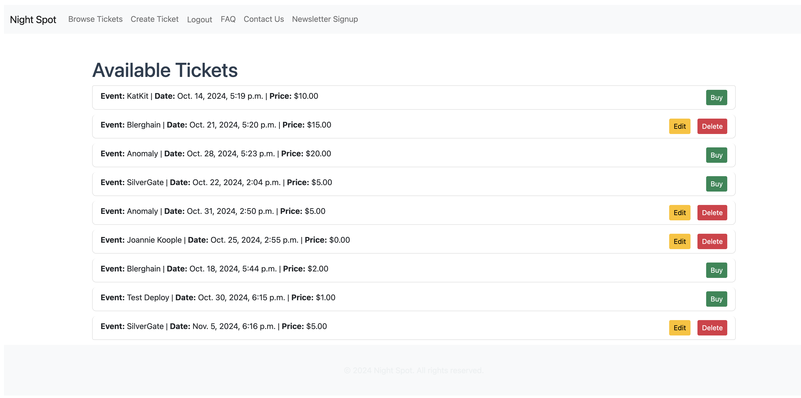

 Night Spot is a platform for users to buy, sell, and buy tickets for nightlife events or nightclub guest list spots. Upon visiting the website, users can browse the list of available tickets. To purchase or sell tickets, users must create an account and log in.. Once logged in, they can access the details of the tickets and proceed to checkout using Stripe for secure payments.

 Users can also create their own listings to sell or buy tickets. Listings are managed through the user dashboard, where sellers can edit or remove their listings. The platform offers a smooth user experience for both buyers and sellers, ensuring secure transactions, notifications, and the ability to leave reviews and ratings after a successful purchase.

## My Goal

 The main goal of Night Spot is to create a safe, user-friendly marketplace where people can resell tickets for nightlife events or offer guest list spots for nightclubs. It bridges the gap between people who have spare tickets and those who are seeking access to sold-out or exclusive events. By providing an easy-to-use interface, Night Spot aims to streamline the process of ticket reselling, reducing the reliance on less secure methods of ticket trading.

 Another key objective is to foster a community-driven platform where buyers and sellers can trust one another through verified profiles, reviews, and seamless payment integrations. Through this, Night Spot ensures a better experience for users, enabling them to focus on the enjoyment of nightlife rather than ticket logistics.

## User Stories 

 I used the agile tools on Git Hub to track my progress and post user stories.

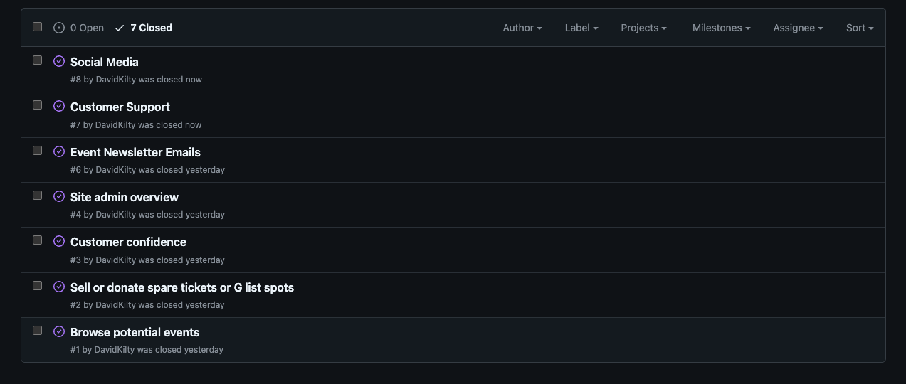
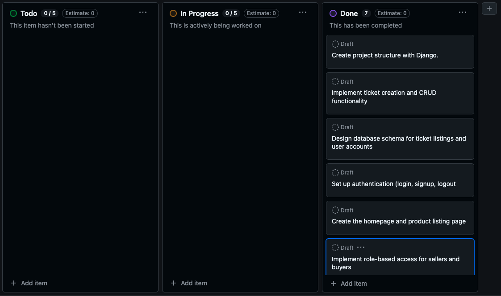

### Event Newsletter Emails
 I implemented an event newsletter feature using the Brevo via an API. I created a form that allows users to submit their email and depending on the API response, success or error messages are displayed.

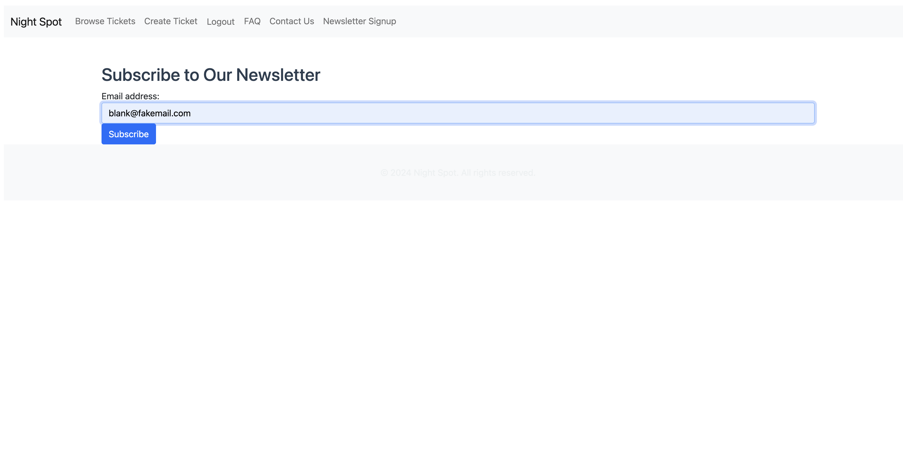

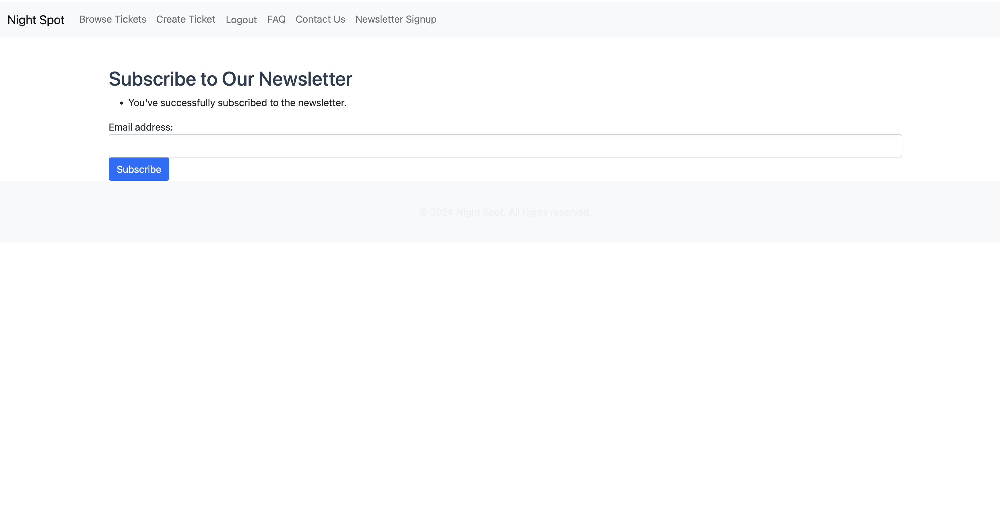

### Site Admin Overview
 I provided admin functionality that allows site administrators to manage ticket listings and users. Admins can review and remove ticket listings, manage user accounts, and oversee transactions through the Django admin interface.

### Customer Confidence
 I implemented Stipe via an API webhook for secure payment processing, so a user can pay for it securely and with confidence. 

### Sell or Donate Spare Tickets or G List Spots
 I implemented a feature where users can list tickets for sale or donate them for 1 EUR (a minimal amount is required as the site would ideally need to take a processing fee at some point in the future). The process involves filling out a form regarding event details and setting the desired price or minimum price option. Users can manage their listings after their log in.

### Browse Potential Events
 I created a browsing feature where users can view all available tickets. Events are listed with key details such as event name, date, and ticket price. 

### Social Media 
 I wanted to make a Facebook page for a social media presence, which builds trust with a customer base. It can also act as the communication channel with the customer, for customer service. Unfortunately, Facebook asks I wait up to 180 days before being allowed to make an account.

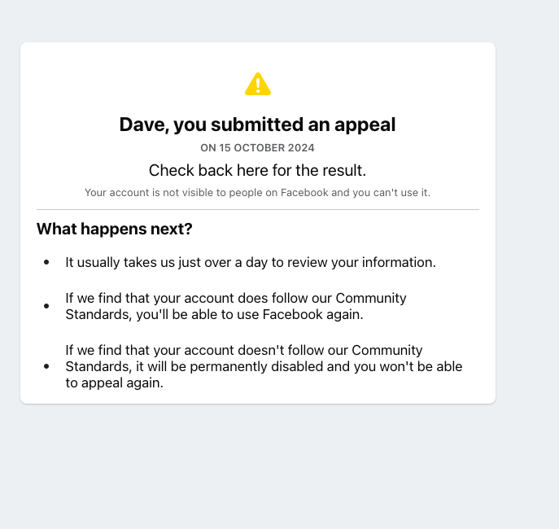

So alternativel I created an Instagram account, that can fulfill what essentially the same needs. It is linked in the NavBar. 

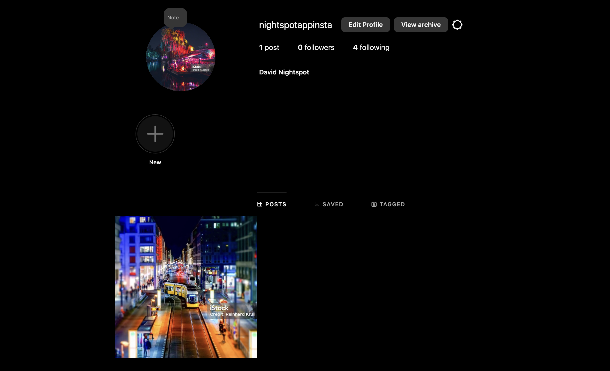

## Operational Tracking 

 I utelized the operational tracking tool in GitHub to keep track of To-Do's and Tasks as they went. 
 https://github.com/users/DavidKilty/projects/3

## Data Models 

 The data models in Night Spot reflect key aspects of ticket trading and user interaction. The Ticket model holds details about the event, such as the name, date, price, and type. The User model manages all user-related information, such as profile details, authentication, and their role (buyer or seller). These models are connected via relationships to support ticket listings and transactions.

 The platform also features an FAQ model, where common user questions are answered, and a ContactForm model for users to get in touch with the site's administration. Each model is designed to handle CRUD functionality, ensuring flexibility and scalability as new features are introduced.

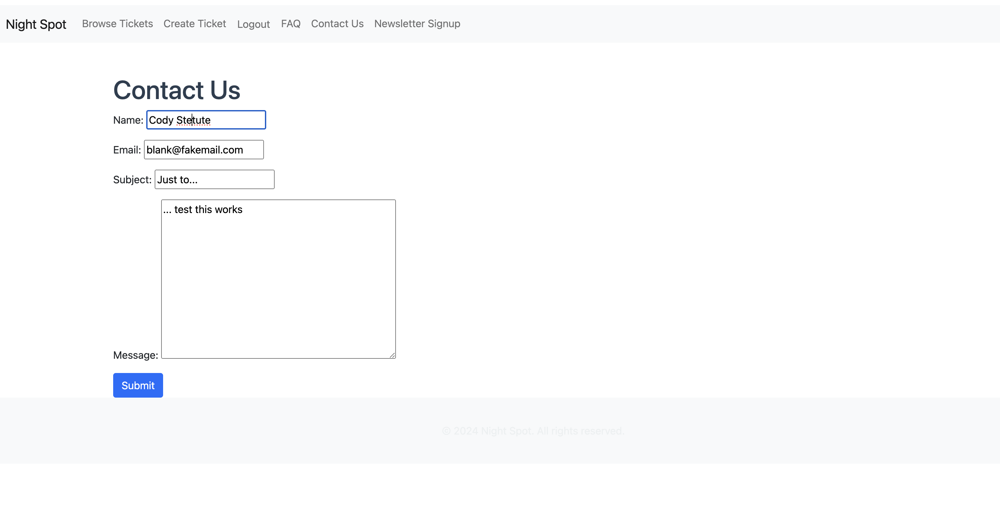

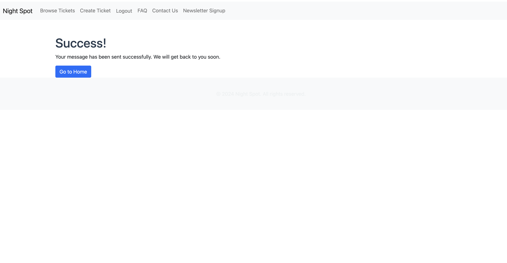

## Credits of Resources 

### Night Spot's development is built on several inspirations and open-source resources. 

The below documentation provided extensive guidance and allowed me the integrate required technologies
 1. Stripe 
 2. Django  
 3. Brevo 

The below resources helped trouble shoot, integrate and enhance my code
 1. Stack Overflow 
 2. Real Python 
 3. W3Schools 
 

### Libraries Utilized

 Night Spot leverages several libraries and tools to provide its functionality. Django serves as the core backend framework, providing robust tools for handling user authentication, data models, and routing. For payments, the Stripe Python SDK is used to manage secure payment processing, while the Brevo (formerly Sendinblue) API handles the newsletter subscription feature.

 On the front-end, Bootstrap ensures that the UI is responsive and user-friendly across devices. Other libraries include Django’s message framework for user notifications, as well as the requests library for making API calls to external services. These libraries help Night Spot function smoothly, offering a secure and pleasant user experience. 

## E-commerce Business Model

### Revenue Model: 
 Night Spot operates on a peer-to-peer transaction basis, in the future real world I would implement charging a service fee on each successful ticket sale through Stripe. This fee ensures the platform remains sustainable and supports future development.

### Target Audience: 
 Night Spot caters to individuals looking to buy or sell secondhand tickets for nightlife events or offer guest list spots to clubs. The platform is built for both casual event-goers and sellers with spare tickets.

### Transaction Model: 
 Users can list tickets for sale, with buyers purchasing directly through a secure checkout system integrated with Stripe. Ticket listings are managed by the seller, and the transaction is completed directly on the platform. The donation option also allows sellers to offer tickets for 1 EUR as a minimal charge.